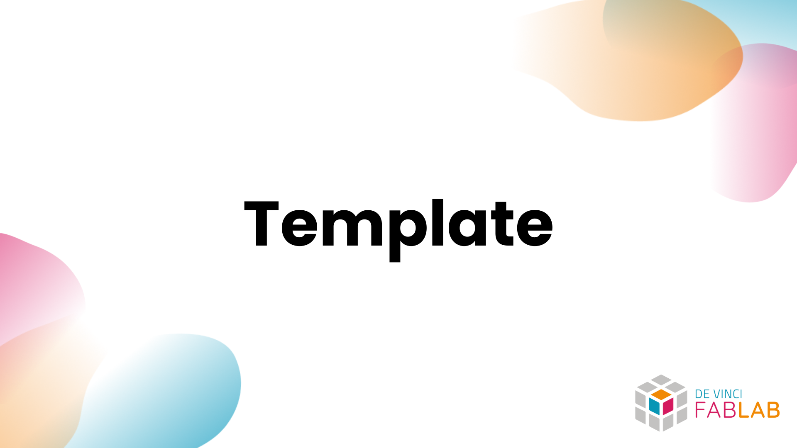

## Overview

> Application mobile de suivi sportif connectée au t-shirt intelligent **Fabshirt**.

Fabshirt est une application React Native (Expo) permettant de suivre des sessions sportives en temps réel : fréquence cardiaque, GPS, distance, et données biométriques captées par le t-shirt connecté. Les utilisateurs peuvent créer un compte puis démarrer et consulter leurs activités.

## Getting Started

- [Overview](#overview)
- [Getting Started](#getting-started)
  - [Documentation](#documentation)
  - [Setting up](#setting-up)
    - [Prerequisites](#prerequisites)
    - [Install](#install)
    - [Build \& Run](#build--run)
    - [Usage](#usage)
  - [Troubleshooting](#troubleshooting)
  - [Supported platforms](#supported-platforms)
  - [Supported languages](#supported-languages)
  - [Future improvements](#future-improvements)
  - [Contributing](#contributing)
  - [License](#license)

### Documentation

La structure du projet suit les conventions d'**Expo Router** (routing basé sur le système de fichiers).
Pour l'instant ça ressemble à ça :

```
app/
├── (tabs)/           # Écrans principaux (barre de navigation)
│   ├── dashboard.tsx     # Accueil, historique et lancement d'activité
│   ├── activities.tsx    # Carte GPS + choix du type d'activité
│   ├── history.tsx       # Historique des sessions
│   └── tshirt.tsx        # État et données du t-shirt connecté
├── login.tsx             # Connexion (pseudo + mot de passe + code à 6 chiffres)
├── signup.tsx            # Inscription
├── verify-code.tsx       # Saisie du code de connexion
├── complete-profile.tsx  # Complétion du profil (données physiques)
├── set-password.tsx      # Changement de mot de passe
└── activity-live.tsx     # Session sportive en cours (BPM, distance, chrono)

components/
├── AppHeader.tsx         # Header avec gestion de session (expiration auto)
├── AppHeaderSimple.tsx   # Header allégé pour les écrans d'activité
└── SessionContext.tsx    # Contexte global de session (React Context)

services/
└── localStorage.ts       # Couche de persistance (AsyncStorage)
```

### Setting up

#### Prerequisites

- [Node.js](https://nodejs.org/) **v18 ou supérieur**
- [npm](https://www.npmjs.com/) v9+ ou [yarn](https://yarnpkg.com/)
- [Expo CLI](https://docs.expo.dev/get-started/installation/) : `npm install -g expo-cli`
- [Expo Go](https://expo.dev/client) installé sur ton téléphone (iOS ou Android), **ou** un émulateur configuré

> [!NOTE]
> Pour tester sur iOS en local, un Mac avec Xcode est nécessaire. Pour Android, Android Studio suffit.

> [!TIP]
> Expo Go est la façon la plus rapide de démarrer : installe l'app sur ton téléphone et scanne le QR code généré par `npx expo start`.

#### Install

Clone le dépôt puis installe les dépendances :

```bash
git clone <url-du-repo>
cd fabshirt
npm install
npx expo install @react-native-async-storage/async-storage
```

> [!WARNING]
> Certaines dépendances natives (comme `react-native-maps` et `expo-location`) nécessitent une configuration supplémentaire si tu builds en natif (sans Expo Go). Consulte la documentation Expo pour le [prebuild](https://docs.expo.dev/workflow/prebuild/).

#### Build & Run

Lance le serveur de développement Expo :

```bash
npx expo start
```

Cela ouvre le **Metro Bundler** dans le terminal et affiche un QR code.

- **Sur téléphone physique** : scanne le QR code avec l'app Expo Go
- **Sur émulateur Android** : appuie sur `a` dans le terminal
- **Sur simulateur iOS** : appuie sur `i` dans le terminal (Mac uniquement)

#### Usage

**Flux de navigation**

1. **Inscription** : Crée un compte avec un pseudo et un mot de passe (min. 6 caractères). Les données physiques (sexe, âge, taille, poids) sont facultatives.

2. **Connexion** : Entre ton pseudo et ton mot de passe. Un **code à 6 chiffres** est généré et s'affiche à l'écran, tu dois le saisir pour accéder à l'app. Ce code expire après 2 minutes d'inactivité (30 minutes en production).

4. **Dashboard** : Page d'accueil avec l'historique de tes sessions et un bouton pour démarrer une nouvelle activité.

5. **Activités** : Affiche ta position GPS sur une carte. Sélectionne le type d'activité (*Course à pied*, *Cyclisme*, *Musculation*) avant de démarrer.

6. **Session en cours** (`activity-live`) : Affiche en temps réel le BPM, la distance et le chronomètre. Tu peux mettre en pause ou arrêter la session.

7. **Historique** : Consulte tes sessions passées avec les données biométriques associées.

> [!IMPORTANT]
> La session de connexion expire automatiquement après 2 minutes d'inactivité en mode développement. Ce délai est paramétrable dans `services/localStorage.ts` via `SESSION_TIMEOUT_MINUTES`.

### Troubleshooting

**Le QR code ne fonctionne pas avec Expo Go**
- Assure-toi que ton téléphone et ton ordinateur sont sur le **même réseau Wi-Fi**.
- Si ça ne marche pas, utilise le mode tunnel : `npx expo start --tunnel`.

**Erreur `Unable to resolve module`**
- Supprime le cache et relance : `npx expo start --clear`
- Réinstalle les dépendances : `rm -rf node_modules && npm install`

**La carte GPS ne s'affiche pas**
- Vérifie que tu as accordé les permissions de localisation à l'app.
- Sur émulateur, configure une position GPS fictive depuis les paramètres de l'émulateur.

**Le code de connexion expire trop vite**
- En développement, `SESSION_TIMEOUT_MINUTES = 2`. Change cette valeur dans `services/localStorage.ts` selon tes besoins.

### Supported platforms

- **iOS** 13+ (testé via Expo Go et simulateur Xcode)
- **Android** 8.0+ (testé via Expo Go et émulateur Android Studio)

> [!NOTE]
> Le build natif (sans Expo Go) n'a pas encore été validé sur les deux plateformes. Des ajustements de configuration peuvent être nécessaires.

### Supported languages

- Français (langue principale de l'interface)

### Future improvements

- Connexion en temps réel au t-shirt via Bluetooth / BLE
- Affichage des données biométriques complètes pendant la session (respiration, transpiration, température)
- Calcul automatique des statistiques de session (allure, calories, FC moyenne)
- Historique détaillé par session avec graphiques

### Contributing

If you want to contribute to the project, you can follow the steps described in the [CONTRIBUTING](./.github/CONTRIBUTING) file.

Deployment guidelines are available in the [DEPLOYMENT](./docs/DEPLOYMENT.md) file.

### License

This project is licensed under the MIT License, which grants you the freedom to:

- Use the software for any purpose (commercial or personal)
- Modify and distribute the software
- Include it in proprietary software
- Sell copies of the software

The only requirement is to include the original copyright notice and license terms in any copy or substantial portion of the software.

For complete license terms and conditions, see the [LICENSE](LICENSE) file for details.